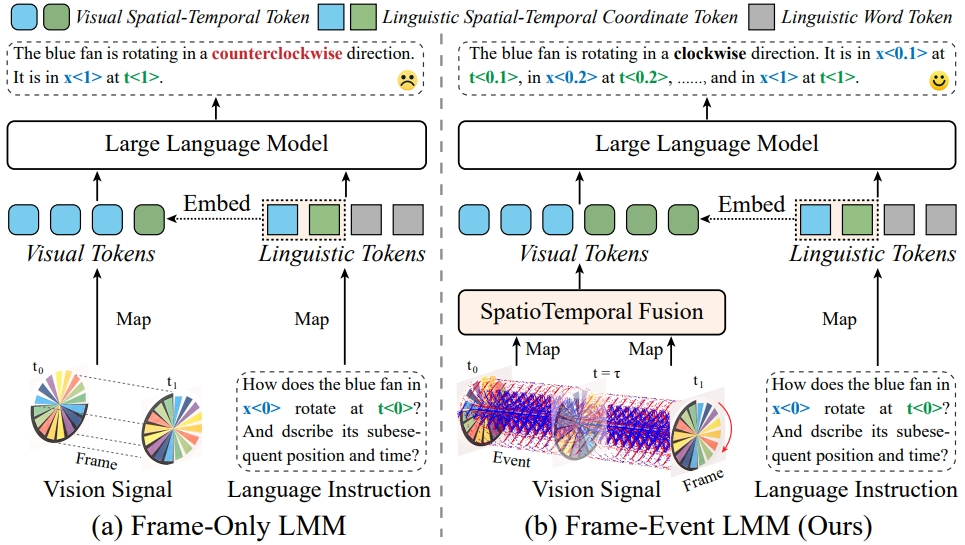

# LLaFEA: Frame-Event Complementary Fusion for Fine-Grained Spatiotemporal Understanding in LMMs

## ICCV2025

### [arXiv Paper](https://arxiv.org/pdf/2503.06934)

[Hanyu Zhou](https://hyzhouboy.github.io/) $^{1*}$, [Gim Hee Lee](https://www.comp.nus.edu.sg/~leegh/) $^{1✉}$

$^1$ National University of Singapore

$^✉$ Corresponding Author.




## News

2025.06.26: Our paper is accepted by ICCV 2025. The code will be updated.


## Citation

If you find this repository/work helpful in your research, welcome to cite this paper and give a ⭐.

```
@article{zhou2025llafea,
  title={LLaFEA: Frame-Event Complementary Fusion for Fine-Grained Spatiotemporal Understanding in LMMs},
  author={Zhou, Hanyu and Lee, Gim Hee},
  journal={arXiv preprint arXiv:2503.06934},
  year={2025}
}
```

